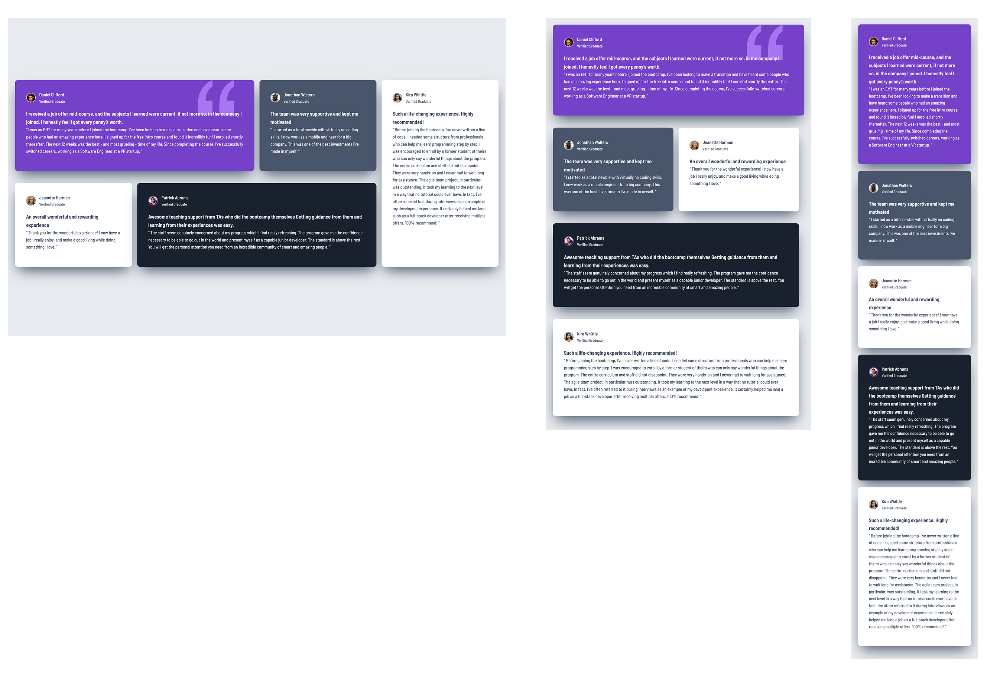

# Frontend Mentor - Testimonials grid section solution

This is a solution to the [Testimonials grid section challenge on Frontend Mentor](https://www.frontendmentor.io/challenges/testimonials-grid-section-Nnw6J7Un7). Frontend Mentor challenges help you improve your coding skills by building realistic projects. 

## Table of contents

- [Overview](#overview)
  - [The challenge](#the-challenge)
  - [Screenshot](#screenshot)
  - [Links](#links)
- [My process](#my-process)
  - [Built with](#built-with)
  - [What I learned](#what-i-learned)
  - [Useful resources](#useful-resources)
  - [AI Collaboration](#ai-collaboration)

## Overview

### The challenge

Users should be able to:

- View the optimal layout for the site depending on their device's screen size

### Screenshot

### Links

- Solution URL: [Git](https://github.com/GimeVerdant/testimonials)
- Live Site URL: [Testimonials Page](https://gimeverdant.github.io/testimonials/)

## My process

### Built with

- Semantic HTML5 markup
- CSS custom properties
- Flexbox
- CSS Grid
- Mobile-first workflow

### What I learned

Css grid and Flex. 
Using an element (H1) vsible only to screen readers for accessibility.
Deploying to a branch, merging

### Useful resources

- [An Interactive Guide to CSS Grid](https://www.joshwcomeau.com/css/interactive-guide-to-grid/) - Great Grid tutorial/guide
- [An Interactive Guide to Flexbox](https://www.joshwcomeau.com/css/interactive-guide-to-flexbox/) - Great Flexbox tutorial/guide

### AI Collaboration

I used Claude.
- at the start, I copy colors and fonts into Claude and ask it to write the root variables.
- when I am done, I ask Claude to check code for accessibility improvements.
- I may ask questions how to approach something - like "whats the best way of targeting these different testimonial cards for styling? with unique id's or with 3 classes? Do Not GIve me the code" 
I used Claude code to create a branch and deploy to it, then I switched to doing it myself so that I can learn to do it before automating it.

